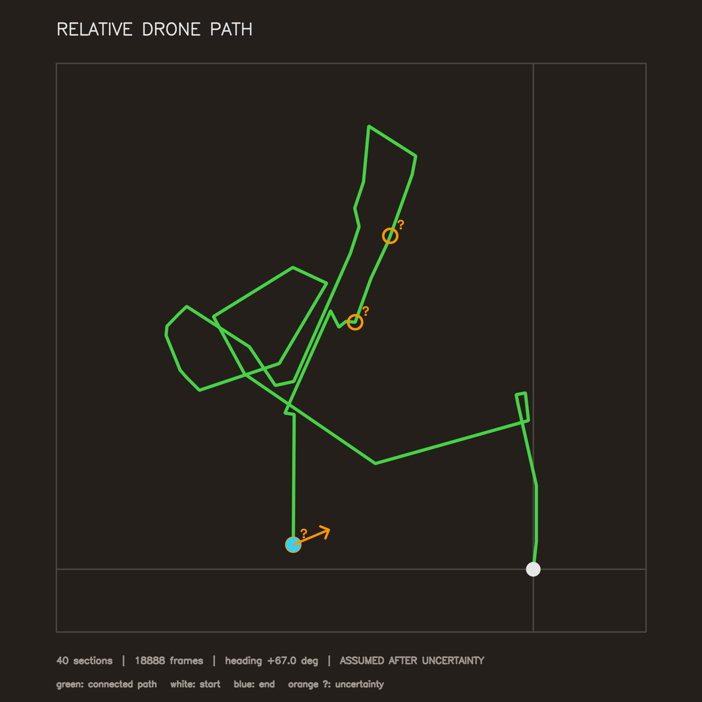
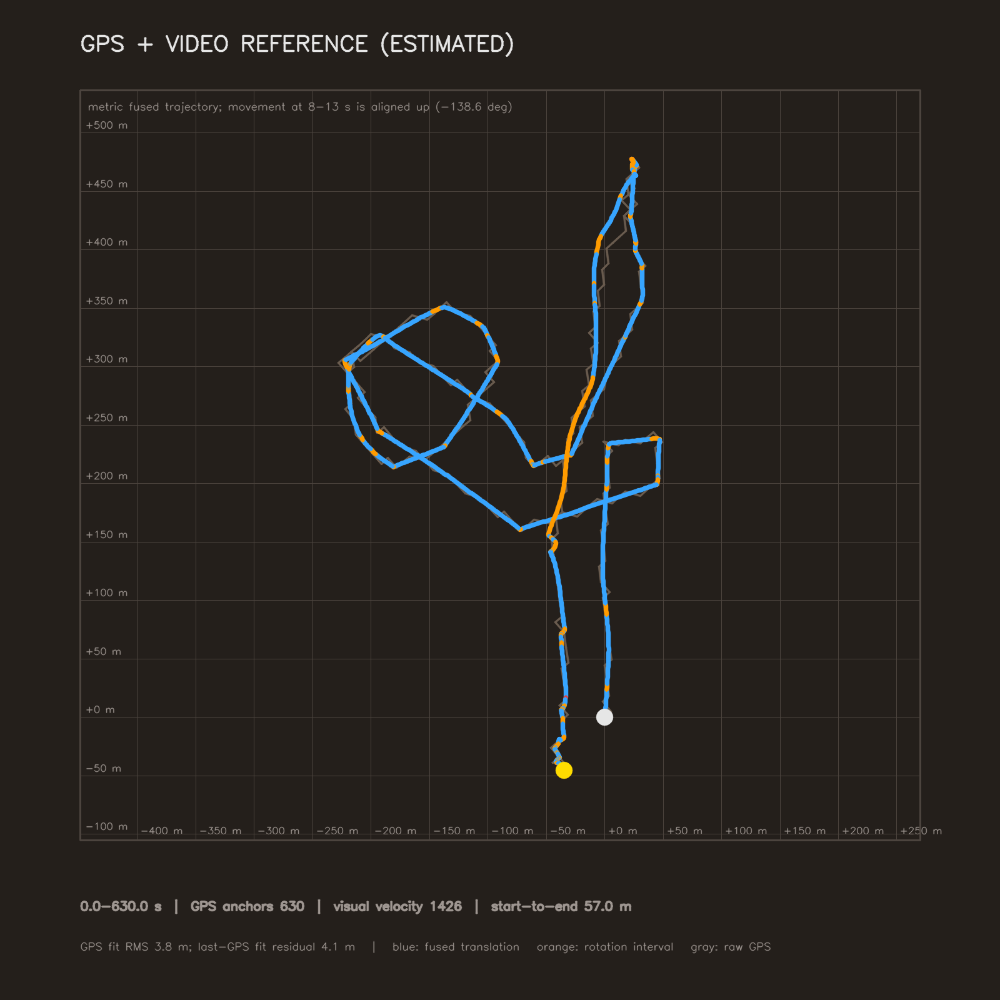

# Drone Path Prediction

Python/OpenCV solution for **Task 1: Drone Path Prediction**. It tracks motion in a drone video and produces a top-down relative flight path.

## Quick start

```bash
python -m venv .venv
```

Activate the environment (`.\.venv\Scripts\Activate.ps1` on Windows PowerShell or `source .venv/bin/activate` on macOS/Linux), then run:

```bash
pip install -r requirements.txt
python main.py video1.MP4
```

Outputs:

- `path.png` - predicted path visualization
- `path.json` - predicted coordinates and processing details

To process only part of a video:

```bash
python main.py video1.MP4 --start 8 --duration 5
```

## Approach

The program detects feature points, tracks them with pyramidal Lucas-Kanade optical flow, separates translation from camera/drone rotation, and joins reliable movement directions into a 2D path. Uncertain sections are marked on the output map.

The main algorithm does **not** use GPS. Its coordinates are relative because a single monocular camera cannot recover absolute scale reliably.

## Results

**Primary optical-flow prediction (`main.py`, no GPS):**



**Optional GPS/video reference (comparison only):**



## Debugging and validation

```bash
python -m debug_ui video1.MP4
python -m reference_gps_and_video video1.MP4 --align 8 13
python -m unittest discover -s tests
```

`debug_ui` shows intermediate decisions while the video plays. `reference_gps_and_video` optionally uses an independent SIFT/homography pipeline and embedded DJI GPS metadata to create an estimated reference for comparison.
